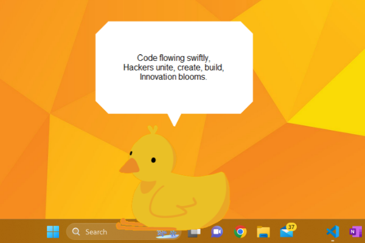
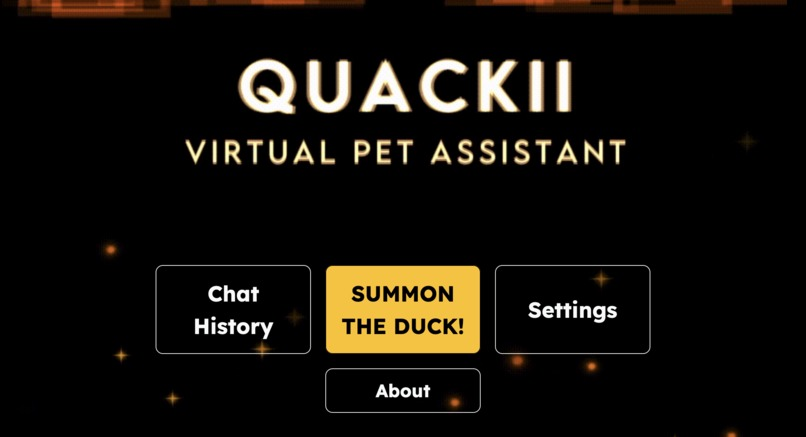

# Quackii
When faced with a difficult coding problem, it's often helpful to use [rubber duck debugging](https://en.wikipedia.org/wiki/Rubber_duck_debugging). We wanted to take this idea a step further, and have the rubber duck itself provide helpful insights and assistance. 

Quackii is a desktop pet that periodically gives you helpful reminders, volunteer opportunities, and can hold a good conversation thanks to it's natural language processing. Quackii can read or create events from your calendar, or relieve stress.

This was our project submission to nwHacks 2024.

# Tech Stack
Quackii is built almost entirely in Python with tkinter for the desktop GUI, and BeautifulSoup4 for webscraping volunteer opportunities. We also used the Google Workspace API for calendar access.

The initialization and settings menu was built in HTML and CSS and connected with Flask. Some components of our UI were created with the Geometry Dash Level Editor. 

